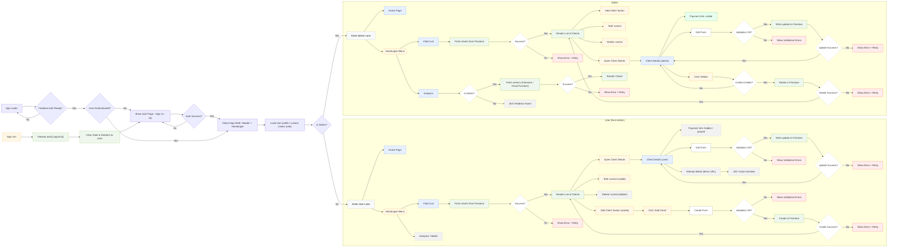

```mermaid
flowchart LR
    %% ========== Entry & Auth ==========
    A["App Loads"] --> B{Firebase Auth Ready?}
    B -->|Yes| C{User Authenticated?}
    B -->|No| A
    C -->|No| D["Show Auth Page - Sign In / Up"]
    D --> E{Auth Success?}
    E -->|Yes| F["Mount App Shell: Header + Hamburger"]
    E -->|No| D
    C -->|Yes| F
    F --> R["Load user profile / custom claims (role)"]
    R --> RA{Is Admin?}

    %% ========== Swimlanes ==========
    subgraph ULANE["User (Non-Admin)"]
      direction TB
      U0["Enter User Lane"]:::lane
      UHOME["Home Page"]:::page
      UMENU{{"Hamburger Menu"}}:::ui
      UCLIENT["Client List"]:::page
      UANALYTICS_HIDDEN["Analytics: hidden"]:::guard

      %% User list & CRUD (no delete)
      UFETCH["Fetch clients from Firestore"]:::op
      UOK{Success?}:::cond
      ULIST["Render List of Clients"]:::op
      UERR["Show Error + Retry"]:::error

      UADD_BTN["'Add Client' button (visible)"]:::ui
      UEDIT_BTN["'Edit' control (visible)"]:::ui
      UDEL_BTN_H["'Delete' control (hidden)"]:::guard

      UOPEN["Open Client Details"]:::ui
      UDETAIL["Client Details (user)"]:::page
      UPAY_GRAY["Payment Info: hidden / grayed"]:::guard

      UEDIT["Edit Form"]:::form
      UVAL{Validation OK?}:::cond
      UWRITE["Write update to Firestore"]:::op
      UUPSERT_OK{Update Success?}:::cond
      UVAL_ERR["Show Validation Errors"]:::error
      UWRITE_ERR["Show Error + Retry"]:::error

      UDEL_ATTEMPT["Attempt delete (direct URL)"]:::guard
      U403["403 / Action blocked"]:::guard

      UCREATE_BTN["Click 'Add Client'"]:::ui
      UCREATE_FORM["Create Form"]:::form
      UCREATE_VAL{Validation OK?}:::cond
      UCREATE_WRITE["Create in Firestore"]:::op
      UCREATE_OK{Create Success?}:::cond
      UCREATE_VAL_ERR["Show Validation Errors"]:::error
      UCREATE_ERR["Show Error + Retry"]:::error
    end

    subgraph ALANE["Admin"]
      direction TB
      A0["Enter Admin Lane"]:::lane
      AHOME["Home Page"]:::page
      AMENU{{"Hamburger Menu"}}:::ui
      ACLIENT["Client List"]:::page
      AANALYTICS["Analytics"]:::page

      AFETCH["Fetch clients from Firestore"]:::op
      AOK{Success?}:::cond
      ALIST["Render List of Clients"]:::op
      AERR["Show Error + Retry"]:::error

      AADD_BTN["'Add Client' button"]:::ui
      AEDIT_BTN["'Edit' control"]:::ui
      ADEL_BTN["'Delete' control"]:::ui

      AOPEN["Open Client Details"]:::ui
      ADETAIL["Client Details (admin)"]:::page
      APAY_SHOW["Payment Info: visible"]:::ok

      AEDIT["Edit Form"]:::form
      AVAL{Validation OK?}:::cond
      AWRITE["Write update to Firestore"]:::op
      AUPSERT_OK{Update Success?}:::cond
      AVAL_ERR["Show Validation Errors"]:::error
      AWRITE_ERR["Show Error + Retry"]:::error

      ADEL["Click 'Delete'"]:::ui
      ADEL_CONF{Confirm Delete?}:::cond
      ADEL_DO["Delete in Firestore"]:::op
      ADEL_OK{Delete Success?}:::cond
      ADEL_ERR["Show Error + Retry"]:::error

      %% Analytics (admin-only)
      JG{Is Admin?}:::cond
      J1["Fetch metrics (Firestore / Cloud Function)"]:::op
      J2{Success?}:::cond
      J3["Render Charts"]:::op
      J4["Show Error + Retry"]:::error
      JX["403 / Redirect Home"]:::guard
    end

    %% ========== Wire up lanes from role check ==========
    RA -->|No| U0
    RA -->|Yes| A0

    %% ========== User lane flows ==========
    U0 --> UHOME
    U0 --> UMENU
    UMENU --> UCLIENT
    UMENU --> UANALYTICS_HIDDEN

    UCLIENT --> UFETCH
    UFETCH --> UOK
    UOK -->|Yes| ULIST
    UOK -->|No| UERR

    ULIST --> UADD_BTN
    ULIST --> UEDIT_BTN
    ULIST --> UDEL_BTN_H
    ULIST --> UOPEN

    UOPEN --> UDETAIL
    UDETAIL --> UPAY_GRAY

    %% Edit (user)
    UDETAIL --> UEDIT
    UEDIT --> UVAL
    UVAL -->|Yes| UWRITE
    UVAL -->|No| UVAL_ERR
    UWRITE --> UUPSERT_OK
    UUPSERT_OK -->|Yes| UDETAIL
    UUPSERT_OK -->|No| UWRITE_ERR

    %% Delete attempt blocked (user)
    UDETAIL --> UDEL_ATTEMPT
    UDEL_ATTEMPT --> U403

    %% Create (user)
    UADD_BTN --> UCREATE_BTN
    UCREATE_BTN --> UCREATE_FORM
    UCREATE_FORM --> UCREATE_VAL
    UCREATE_VAL -->|Yes| UCREATE_WRITE
    UCREATE_VAL -->|No| UCREATE_VAL_ERR
    UCREATE_WRITE --> UCREATE_OK
    UCREATE_OK -->|Yes| ULIST
    UCREATE_OK -->|No| UCREATE_ERR

    %% ========== Admin lane flows ==========
    A0 --> AHOME
    A0 --> AMENU
    AMENU --> ACLIENT
    AMENU --> AANALYTICS

    ACLIENT --> AFETCH
    AFETCH --> AOK
    AOK -->|Yes| ALIST
    AOK -->|No| AERR

    ALIST --> AADD_BTN
    ALIST --> AEDIT_BTN
    ALIST --> ADEL_BTN
    ALIST --> AOPEN

    AOPEN --> ADETAIL
    ADETAIL --> APAY_SHOW

    %% Edit (admin)
    ADETAIL --> AEDIT
    AEDIT --> AVAL
    AVAL -->|Yes| AWRITE
    AVAL -->|No| AVAL_ERR
    AWRITE --> AUPSERT_OK
    AUPSERT_OK -->|Yes| ADETAIL
    AUPSERT_OK -->|No| AWRITE_ERR

    %% Delete (admin)
    ADETAIL --> ADEL
    ADEL --> ADEL_CONF
    ADEL_CONF -->|Yes| ADEL_DO
    ADEL_CONF -->|No| ADETAIL
    ADEL_DO --> ADEL_OK
    ADEL_OK -->|Yes| ALIST
    ADEL_OK -->|No| ADEL_ERR

    %% Analytics (admin-only route + fetch)
    AANALYTICS --> JG
    JG -->|Yes| J1
    JG -->|No| JX
    J1 --> J2
    J2 -->|Yes| J3
    J2 -->|No| J4

    %% ========== Shared: Sign out & global guard ==========
    K["Sign Out"]:::ui --> L["firebase.auth().signOut()"]:::op
    L --> M["Clear State & Redirect to Auth"]:::op
    M --> D

    classDef lane fill:#f8f9fa,stroke:#bbb,color:#111;
    classDef page fill:#e7f0ff,stroke:#7aa2ff;
    classDef ui fill:#fff7e6,stroke:#ffb74d;
    classDef op fill:#eef7ee,stroke:#8bc34a;
    classDef error fill:#ffecec,stroke:#ff6b6b;
    classDef cond fill:#fff,stroke:#999,stroke-dasharray: 4 3;
    classDef guard fill:#f2f2f2,stroke:#c0c0c0,stroke-dasharray: 3 2;
    classDef form fill:#fff,stroke:#8e8e8e;
    classDef ok fill:#e8fff0,stroke:#49c177;
```