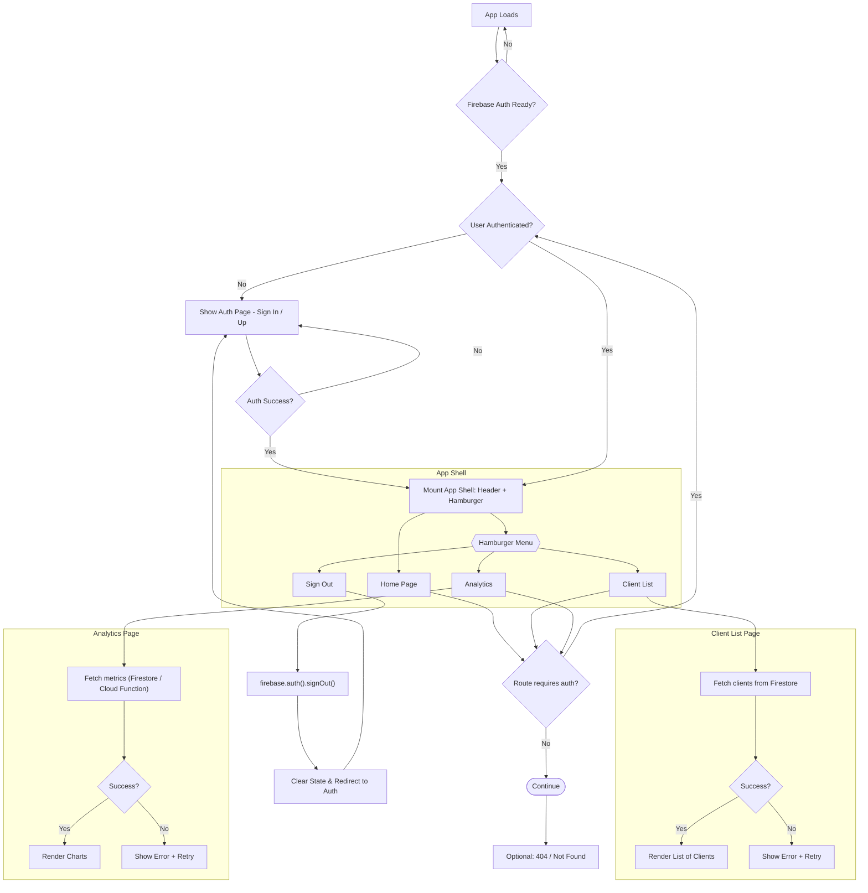

```mermaid
flowchart TD
    %% Entry
    A[App Loads] --> B{Firebase Auth Ready?}
    B -->|Yes| C{User Authenticated?}
    B -->|No| A

    %% Auth gate
    C -->|No| D["Show Auth Page - Sign In / Up"]
    D --> E{Auth Success?}
    E -->|Yes| F["Mount App Shell: Header + Hamburger"]
    E -->|No| D

    C -->|Yes| F

    %% App Shell & Nav
    subgraph S1["App Shell"]
      direction TB
      F --> G["Home Page"]
      F --> H{{"Hamburger Menu"}}
      H --> I["Client List"]
      H --> J["Analytics"]
      H --> K["Sign Out"]
    end

    %% Client List page
    subgraph S2["Client List Page"]
      direction TB
      I --> I1["Fetch clients from Firestore"]
      I1 --> I2{Success?}
      I2 -->|Yes| I3["Render List of Clients"]
      I2 -->|No| I4["Show Error + Retry"]
    end

    %% Analytics page
    subgraph S3["Analytics Page"]
      direction TB
      J --> J1["Fetch metrics (Firestore / Cloud Function)"]
      J1 --> J2{Success?}
      J2 -->|Yes| J3["Render Charts"]
      J2 -->|No| J4["Show Error + Retry"]
    end

    %% Sign out
    K --> L["firebase.auth().signOut()"]
    L --> M["Clear State & Redirect to Auth"]
    M --> D

    %% Global: Protected Routes
    G --> PR{Route requires auth?}
    I --> PR
    J --> PR
    PR -->|Yes| C
    PR -->|No| CONTINUE(["Continue"])

    %% Optional 404
    CONTINUE --> N["Optional: 404 / Not Found"]
```