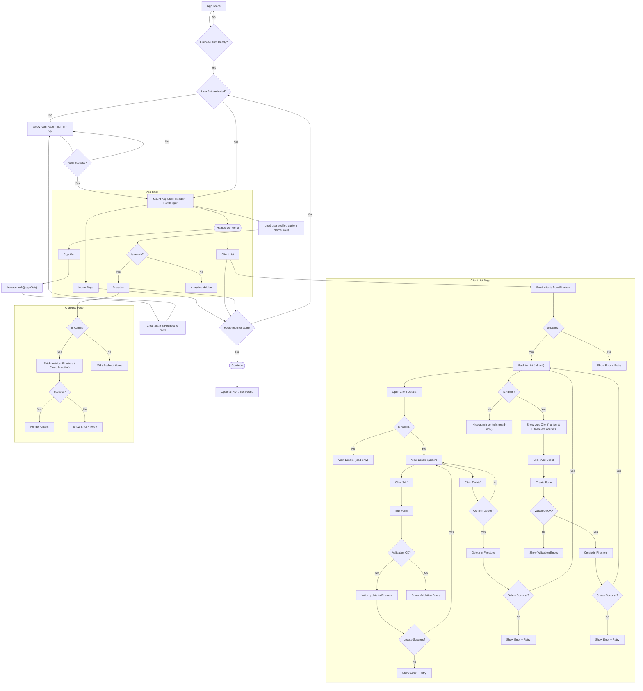

```mermaid
flowchart TD
    %% Entry
    A["App Loads"] --> B{Firebase Auth Ready?}
    B -->|Yes| C{User Authenticated?}
    B -->|No| A

    %% Auth gate
    C -->|No| D["Show Auth Page - Sign In / Up"]
    D --> E{Auth Success?}
    E -->|Yes| F["Mount App Shell: Header + Hamburger"]
    E -->|No| D

    C -->|Yes| F

    %% Load role/claims before rendering nav
    F --> R["Load user profile / custom claims (role)"]
    R --> RA{Is Admin?}

    %% App Shell & Nav (role-aware)
    subgraph S1["App Shell"]
      direction TB
      F --> G["Home Page"]

      %% Hamburger shows items conditionally
      F --> H{{"Hamburger Menu"}}
      H --> I["Client List"]

      %% Analytics only when admin
      RA -->|Yes| J["Analytics"]
      RA -->|No| JH["Analytics Hidden"]

      H --> K["Sign Out"]
    end

    %% Client List page (role-aware actions)
    subgraph S2["Client List Page"]
      direction TB
      I --> I1["Fetch clients from Firestore"]
      I1 --> I2{Success?}
      I2 -->|Yes| I3["Render List of Clients"]
      I2 -->|No| I4["Show Error + Retry"]

      %% Admin sees 'Add Client' and edit/delete controls
      I3 --> I3A{Is Admin?}
      I3A -->|Yes| I3A1["Show 'Add Client' button & Edit/Delete controls"]
      I3A -->|No| I3A2["Hide admin controls (read-only)"]

      %% Open a client
      I3 --> CS["Open Client Details"]

      %% Read-only view for users
      CS --> RU{Is Admin?}
      RU -->|No| V1["View Details (read-only)"]

      %% Admin: Edit flow
      RU -->|Yes| A_VIEW["View Details (admin)"]
      A_VIEW --> E1["Click 'Edit'"]
      E1 --> E2["Edit Form"]
      E2 --> E3{Validation OK?}
      E3 -->|Yes| E4["Write update to Firestore"]
      E3 -->|No| E5["Show Validation Errors"]
      E4 --> E6{Update Success?}
      E6 -->|Yes| A_VIEW
      E6 -->|No| E7["Show Error + Retry"]

      %% Admin: Delete flow
      A_VIEW --> D1["Click 'Delete'"]
      D1 --> D2{Confirm Delete?}
      D2 -->|Yes| D3["Delete in Firestore"]
      D2 -->|No| A_VIEW
      D3 --> D4{Delete Success?}
      D4 -->|Yes| I3["Back to List (refresh)"]
      D4 -->|No| D5["Show Error + Retry"]

      %% Admin: Create flow
      I3A1 --> C1["Click 'Add Client'"]
      C1 --> C2["Create Form"]
      C2 --> C3{Validation OK?}
      C3 -->|Yes| C4["Create in Firestore"]
      C3 -->|No| C5["Show Validation Errors"]
      C4 --> C6{Create Success?}
      C6 -->|Yes| I3["Back to List (refresh)"]
      C6 -->|No| C7["Show Error + Retry"]
    end

    %% Analytics page (admin-only route guard + fetch)
    subgraph S3["Analytics Page"]
      direction TB
      J --> JG{Is Admin?}
      JG -->|Yes| J1["Fetch metrics (Firestore / Cloud Function)"]
      JG -->|No| JX["403 / Redirect Home"]

      J1 --> J2{Success?}
      J2 -->|Yes| J3["Render Charts"]
      J2 -->|No| J4["Show Error + Retry"]
    end

    %% Sign out
    K --> L["firebase.auth().signOut()"]
    L --> M["Clear State & Redirect to Auth"]
    M --> D

    %% Global: Protected Routes (auth check)
    G --> PR{Route requires auth?}
    I --> PR
    J --> PR
    PR -->|Yes| C
    PR -->|No| CONTINUE(["Continue"])

    %% Optional 404
    CONTINUE --> N["Optional: 404 / Not Found"]
```