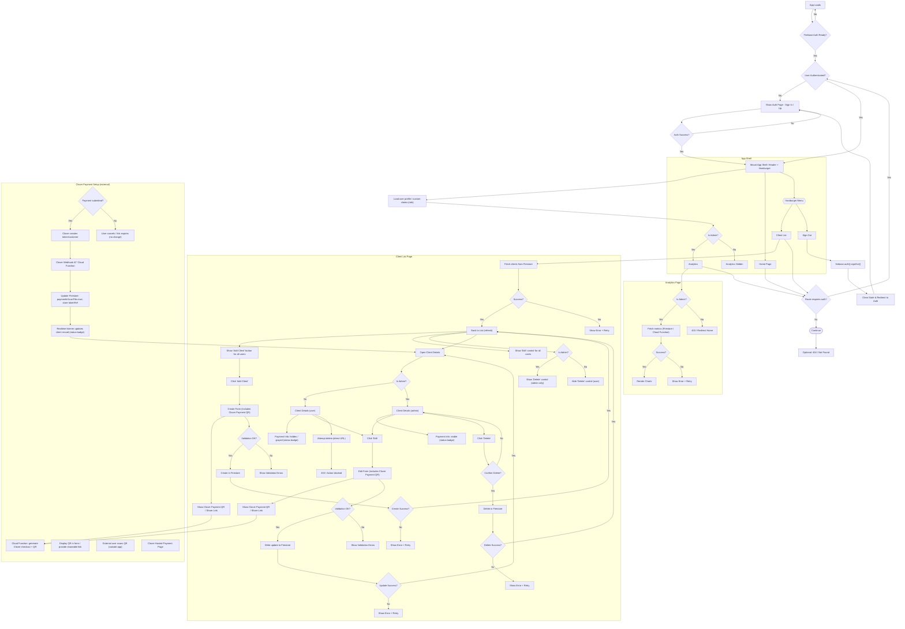

```mermaid
flowchart TD
    %% Entry
    A["App Loads"] --> B{Firebase Auth Ready?}
    B -->|Yes| C{User Authenticated?}
    B -->|No| A

    %% Auth gate
    C -->|No| D["Show Auth Page - Sign In / Up"]
    D --> E{Auth Success?}
    E -->|Yes| F["Mount App Shell: Header + Hamburger"]
    E -->|No| D

    C -->|Yes| F

    %% Load role/claims before rendering nav
    F --> R["Load user profile / custom claims (role)"]
    R --> RA{Is Admin?}

    %% App Shell & Nav (role-aware)
    subgraph S1["App Shell"]
      direction TB
      F --> G["Home Page"]
      F --> H{{"Hamburger Menu"}}
      H --> I["Client List"]

      %% Analytics only when admin
      RA -->|Yes| J["Analytics"]
      RA -->|No| JH["Analytics Hidden"]

      H --> K["Sign Out"]
    end

    %% Client List page (role-aware actions)
    subgraph S2["Client List Page"]
      direction TB
      I --> I1["Fetch clients from Firestore"]
      I1 --> I2{Success?}
      I2 -->|Yes| I3["Render List of Clients"]
      I2 -->|No| I4["Show Error + Retry"]

      %% Controls visibility
      I3 --> I3C["Show 'Add Client' button for all users"]
      I3 --> I3B["Show 'Edit' control for all users"]
      I3 --> I3A{Is Admin?}
      I3A -->|Yes| I3A1["Show 'Delete' control (admin only)"]
      I3A -->|No| I3A2["Hide 'Delete' control (user)"]

      %% Open a client
      I3 --> CS["Open Client Details"]

      %% Detail view varies by role
      CS --> RU{Is Admin?}
      RU -->|No| U_VIEW["Client Details (user)"]
      RU -->|Yes| A_VIEW["Client Details (admin)"]

      %% Payment info visibility
      U_VIEW --> P0["Payment Info: hidden / grayed (status badge)"]
      A_VIEW --> P1["Payment Info: visible (status badge)"]

      %% Shared: Edit flow (both user and admin)
      U_VIEW --> E1["Click 'Edit'"]
      A_VIEW --> E1
      E1 --> E2["Edit Form (includes Clover Payment QR)"]
      %% NEW: Edit includes Clover QR branch
      E2 --> E2Q["Show Clover Payment QR / Share Link"]
      E2 --> E3{Validation OK?}
      E3 -->|Yes| E4["Write update to Firestore"]
      E3 -->|No| E5["Show Validation Errors"]
      E4 --> E6{Update Success?}
      E6 -->|Yes| CS
      E6 -->|No| E7["Show Error + Retry"]

      %% Admin: Delete flow (button only visible to admin)
      A_VIEW --> D1["Click 'Delete'"]
      D1 --> D2{Confirm Delete?}
      D2 -->|Yes| D3["Delete in Firestore"]
      D2 -->|No| A_VIEW
      D3 --> D4{Delete Success?}
      D4 -->|Yes| I3["Back to List (refresh)"]
      D4 -->|No| D5["Show Error + Retry"]

      %% User: direct delete attempt blocked (route/API guard)
      U_VIEW --> D0["Attempt delete (direct URL)"]
      D0 --> DX["403 / Action blocked"]

      %% Create flow (available to all users)
      I3C --> C1["Click 'Add Client'"]
      C1 --> C2["Create Form (includes Clover Payment QR)"]
      %% NEW: Create includes Clover QR branch
      C2 --> C2Q["Show Clover Payment QR / Share Link"]
      C2 --> C3{Validation OK?}
      C3 -->|Yes| C4["Create in Firestore"]
      C3 -->|No| C5["Show Validation Errors"]
      C4 --> C6{Create Success?}
      C6 -->|Yes| I3["Back to List (refresh)"]
      C6 -->|No| C7["Show Error + Retry"]
    end

    %% NEW: Clover Payment Setup (external interaction, off-app)
    subgraph S4["Clover Payment Setup (external)"]
      direction TB
      Q0["Cloud Function: generate Clover checkout + QR"] 
      Q1["Display QR in form / provide shareable link"]
      QX["External user scans QR (outside app)"]
      Q2["Clover Hosted Payment Page"]
      Q3{Payment submitted?}
      Q3 -->|Yes| Q4["Clover creates token/customer"]
      Q4 --> Q5["Clover Webhook → Cloud Function"]
      Q5 --> Q6["Update Firestore: paymentInfo.onFile=true; store tokenRef"]
      Q6 --> Q7["Realtime listener updates client record (status badge)"]
      Q3 -->|No| Q9["User cancels / link expires (no change)"]
    end

    %% Wire QR branches into Clover flow
    E2Q --> Q0
    C2Q --> Q0
    %% After webhook updates, bring user back to details
    Q7 --> CS

    %% Analytics page (admin-only route guard + fetch)
    subgraph S3["Analytics Page"]
      direction TB
      J --> JG{Is Admin?}
      JG -->|Yes| J1["Fetch metrics (Firestore / Cloud Function)"]
      JG -->|No| JX["403 / Redirect Home"]

      J1 --> J2{Success?}
      J2 -->|Yes| J3["Render Charts"]
      J2 -->|No| J4["Show Error + Retry"]
    end

    %% Sign out
    K --> L["firebase.auth().signOut()"]
    L --> M["Clear State & Redirect to Auth"]
    M --> D

    %% Global: Protected Routes (auth check)
    G --> PR{Route requires auth?}
    I --> PR
    J --> PR
    PR -->|Yes| C
    PR -->|No| CONTINUE(["Continue"])

    %% Optional 404
    CONTINUE --> N["Optional: 404 / Not Found"]
```